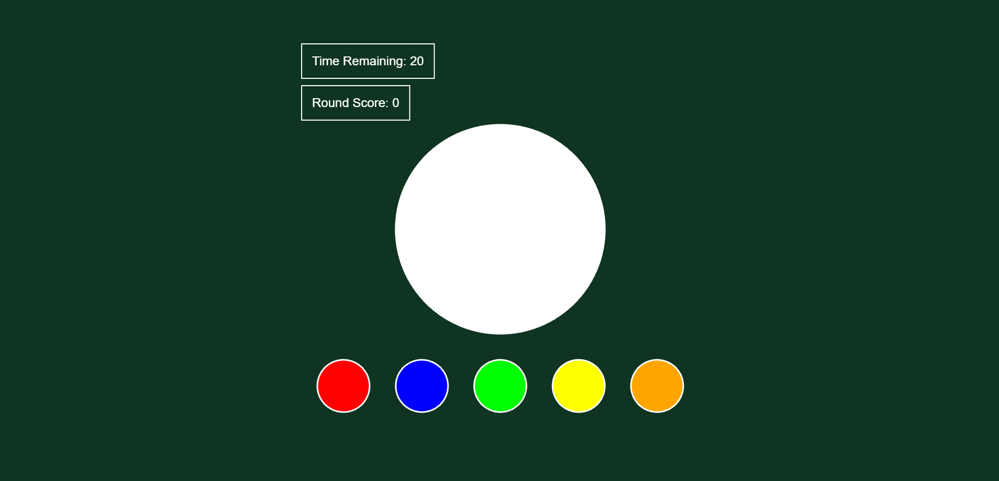

# Roxor Gaming Take Home Task



## Design choices
- Followed specification for simple game with extra meta data on results page.
- Used JavaScript timing events: setTimeout and setIntervals for updating game components, instead of using Pixi ticker.
- Calls API to get random number but has a random number generator for fallback.
- config in src/index.js describes component positions, styling and timer duration.
***
## Run Demo Instructions
1. Clone this repo.
2. Install necessary packages
```
npm install package.json
```
3. Run demo with webpack-dev-server. Opens tab on http://localhost:3000/
```
npm start
```

***
## Build Instructions
1. Clone this repo.
2. Install necessary packages
```
npm install package.json
```
3. Build files
```
npm run build
```

***
## Testing
I've tried using Jest for testing front-end components but had problems testing Pixi.js objects with Jest. 
